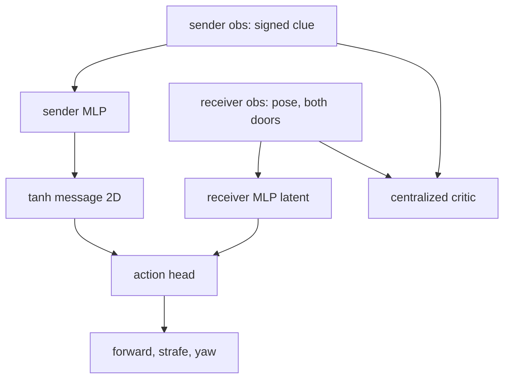

# Communication

https://github.com/user-attachments/assets/d7430988-2484-45f3-8af7-1b3a204cc340

Multi-agent cooperative puzzle environment running on **mjlab + MuJoCo Warp** with continuous controls, procedural rooms, 3D playback, and **rsl-rl PPO** training.

## Installation

```bash
python -m venv .venv
source .venv/bin/activate
pip install -e .
# ffmpeg must be on PATH to record MP4s (e.g. brew install ffmpeg)
```

Or with uv:

```bash
uv sync
```

## Usage

### Training (headless mjwarp + rsl-rl)

```bash
escape-room-train --num-envs 32768 --num-updates 50 --physics-substeps 1 --ckpt-dir ./ckpts --device cuda:0

# equivalent, from a source checkout without installing
python scripts/train.py --num-envs 32768 --num-updates 50 --physics-substeps 1 --ckpt-dir ./ckpts --device cuda:0
```

## Communication Scenario

`communication` task: The clue-holder is fixed in a sealed room with a visible arrow and a private observation `[signed clue, remaining time]`. The receiver starts centered in a separate room with both symmetric doorways in its 120-degree first-person view; its observation contains only local pose/velocity, vectors to both doors, and remaining time.

The actor uses a one way, cont. channel:


Result:

| Correct | Wrong | Timeout | Zero message (success) | Shuffled message (success) |
|---:|---:|---:|---:|---:|
| 100.00% | 0.00% | 0.00% | 50.00% | 48.6% |

### Train, evaluate, and record

```bash
# Local/CUDA training; model_final.pt is always written at completion.
escape-room-train --task communication --num-envs 32768 --num-updates 1000 \
  --steps-per-update 16 --message-dim 2 --seed 42 --ckpt-dir ckpts/communication_42

# 4,096 balanced held-out episodes, nearest-centroid probe, and channel ablations.
# Writes model_final.evaluation.json and model_final.message_probe.json beside the checkpoint.
escape-room-evaluate --ckpt ckpts/communication_42/model_final.pt \
  --episodes 4096 --device cuda:0 --seed 42

# Both first-person views side by side, with the raw vector and diagnostic probe below.
escape-room-play --task communication --policy checkpoint \
  --ckpt ckpts/communication_42/model_final.pt --headless \
  --record demos/communication.mp4 --steps 100 --width 480 --height 270
```

### Play / demo (live window)

```bash
# Heuristic demo (no checkpoint needed) — opens the MuJoCo 3D viewer
escape-room-play

# Random agents
escape-room-play --policy random

# Trained rsl-rl checkpoint
escape-room-play --ckpt ./ckpts/model_49.pt
```

### Record video

```bash
# MuJoCo offscreen rendering (servers / CI)
escape-room-play --headless --policy heuristic --record demos/escape_demo.mp4 --steps 400

# rsl-rl checkpoint rollout to video
escape-room-play --headless --ckpt ./ckpts/model_49.pt --record demos/policy.mp4 --steps 400
```

Without a desktop display, the interactive command starts mjlab's Viser 3D viewer and prints its browser URL. `ffmpeg` must be on `PATH` for MP4 output.
On macOS, the regular `python scripts/play.py ...` command automatically restarts itself with MuJoCo's required `mjpython` launcher before opening the native 3D viewer.

## Architecture

```
escape_room/
  communication/       # Independent Direct DIAL scene, actor, evaluation, and probe
  consts.py            # Caps / rewards / obs dims
  level_gen.py         # Procedural room recipes
  scene.py             # Fixed-topology MuJoCo entity composition
  warp_game.py         # Fused Warp game/observation kernels (default backend)
  mjlab_env.py         # Physical game/action term and MDP providers
  env_cfg.py / env.py  # mjlab and rsl-rl configuration/construction
  train.py             # rsl-rl PPO and trainer-inclusive SPS (escape-room-train)
  play.py              # Native/Viser 3D viewer + MuJoCo MP4 (escape-room-play)
  vec_env.py           # Isolated kinematic microbenchmark fallback
scripts/
  train.py / play.py   # Thin wrappers for source checkouts
  sim_bench.py         # Rollout-only simulation benchmark
hpc/
  comm.sbatch          # Snellius short-training + benchmark job
  communication.sbatch # Staged communication test/profile/train/evaluate/record job
  optbench.sbatch      # A/B harness: one allocation, many variants
  compare_original.sbatch  # Upstream Madrona head-to-head
```

## Requirements

- Python >= 3.10, `mjlab>=1.6,<1.7`, and Pillow
- NVIDIA GPU required for high-throughput mjwarp training; CPU is supported for light playback/tests
- `ffmpeg` on PATH to write MP4s

## License

Same as original Madrona Escape Room (see LICENSE).
