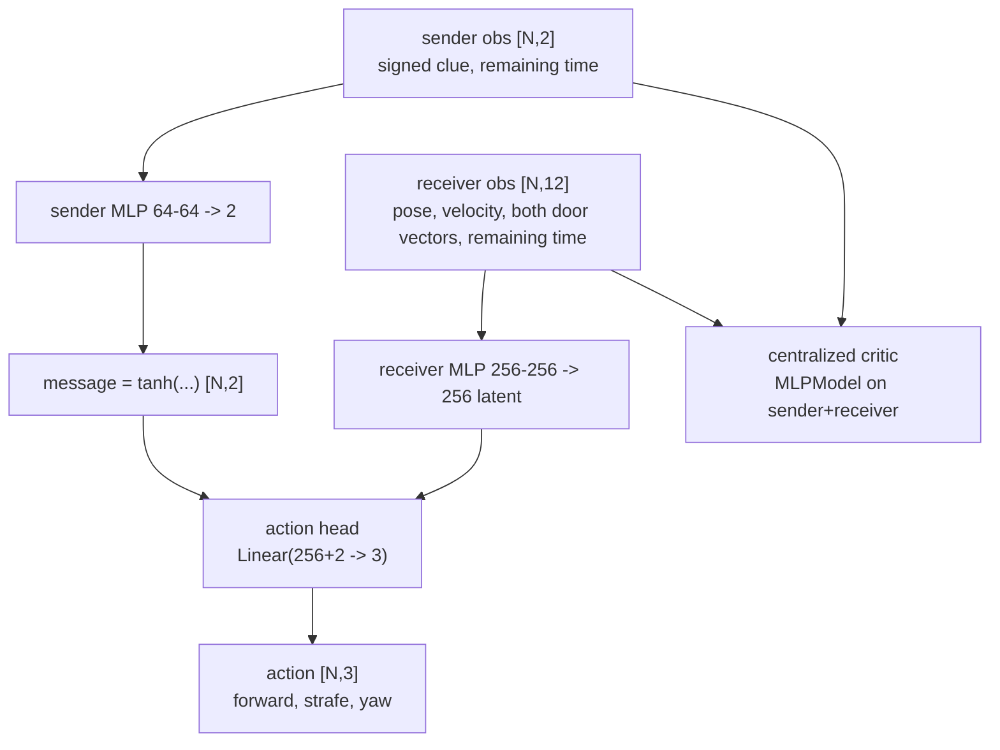
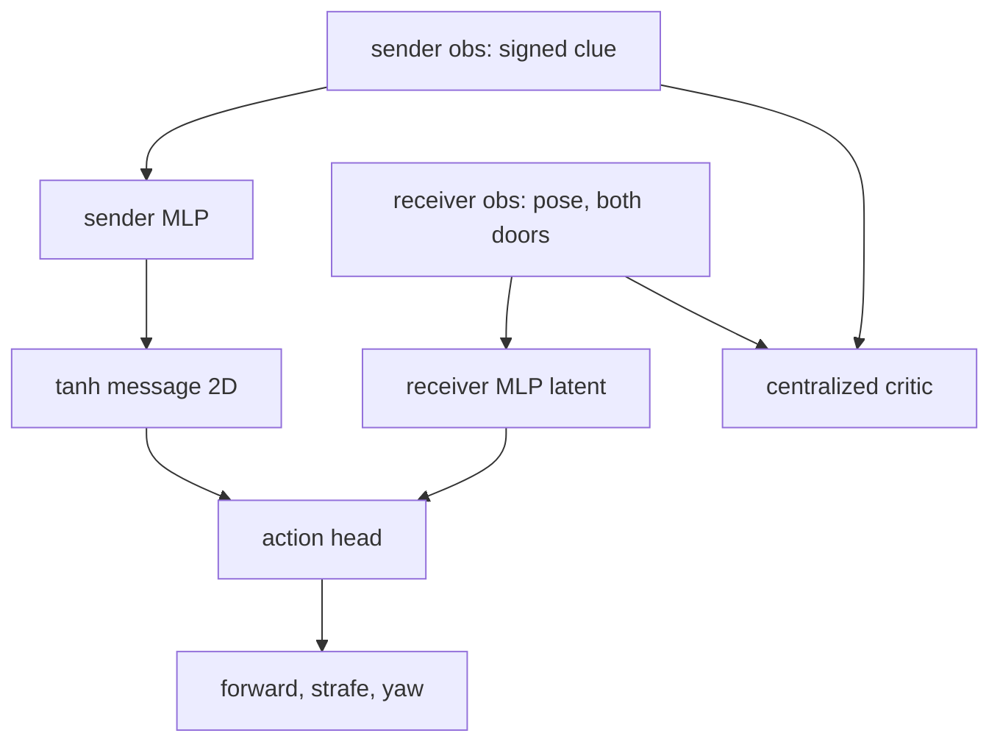

# Communication

https://github.com/user-attachments/assets/d7430988-2484-45f3-8af7-1b3a204cc340

Multi-agent cooperative puzzle environment running on **mjlab + MuJoCo Warp** with continuous controls, procedural rooms, 3D playback, and **rsl-rl PPO** training.

The repository also includes an independent **two-agent Direct DIAL communication scenario**: a fixed sender sees a private left/right arrow, emits a learned continuous vector, and a mobile receiver must enter the matching one of two visible doorways.

## Overview

Two agents navigate through 3 procedural rooms, solving puzzles involving buttons, doors, and cubes to maximize progress:

- **2 agents** with continuous controls (move, yaw, grab)
- **3 procedural rooms** (SingleButton, DoubleButton, CubeBlocking, CubeButtons)
- **Buttons & doors** that require cooperation
- **Physical cube grab** using a forward ray, exclusive attachment, carried motion, and toggle release
- **Egocentric + lidar-style observations**
- **Progress-based rewards** with partner bonus

## Installation

```bash
python -m venv .venv
source .venv/bin/activate
pip install -e .
# ffmpeg must be on PATH to record MP4s (e.g. brew install ffmpeg)
```

Or with uv:

```bash
uv sync
```

## Usage

### Training (headless mjwarp + rsl-rl)

```bash
escape-room-train --num-envs 32768 --num-updates 50 --physics-substeps 1 --ckpt-dir ./ckpts --device cuda:0

# equivalent, from a source checkout without installing
python scripts/train.py --num-envs 32768 --num-updates 50 --physics-substeps 1 --ckpt-dir ./ckpts --device cuda:0
```

The final `trainer_env_SPS` and `trainer_agent_SPS` values use the complete `runner.learn(...)` wall time: policy inference, MuJoCo-Warp rollout, PPO optimization, and logging. `scripts/sim_bench.py` is the separate rollout-only microbenchmark; its `rollout_only_*` figures are not trainer SPS. The default uses the original environment's single 0.04 s physics step; increase `--physics-substeps` for integration-sensitive experiments at a roughly proportional simulation cost. Use `--check-nans` only when debugging because rsl-rl's per-transition checks synchronize the GPU. The Gaussian policy learns log standard deviation so PPO cannot drive the exploration scale through zero; playback still detects and loads older scalar-standard-deviation checkpoints.

The game systems run as four fused MuJoCo-Warp kernels (`escape_room/warp_game.py`) launched beside the physics kernels over the same batched state: one pre-step kernel publishes cube poses and updates buttons, doors, and grab; one apply kernel drives agents, carries held cubes, and slides the doors; one reward kernel folds progress, partner bonus, and slack together; and one observation kernel writes the complete 188-value vector per world straight into a persistent buffer. That replaces roughly two hundred small eager launches and the per-step temporaries and concatenations they needed. `--game-backend torch` keeps the equivalent eager PyTorch implementation for debugging and parity tests. Headless training additionally uses a specialized synchronous step: root poses are read directly from post-integration `qpos`, the unused sensor/forward graph is skipped, synchronous timeout reset avoids a per-step dynamic `nonzero`, and the single action/observation term bypasses redundant manager copies. Interactive and recorded 3D playback retain mjlab's generic refresh path.

The scene allocates only the cube bodies the level recipes can actually use. `generate_level` produces a fixed room sequence that needs `5` cubes, so `--cube-layout fixed` (the default) allocates `5` free bodies instead of the previous `12`, of which `7` were always parked and inactive. `--cube-layout recipe` allocates the `9` that cover every room type if the sequence is randomized, and `--cube-layout legacy` restores the original `12`; the level pool validates at construction that every cube a recipe activates has a body, so an unsupported combination fails with an actionable error instead of silently dropping cubes.

The profiled performance default of `32768` environments, `16` rollout steps, and `1` physics substep leaves about `26 GiB` free on a 40 GiB A100. A 32-step rollout reached only 1% higher SPS, so 16 remains the default. Contact/constraint buffers are sized to the measured escape-room workload (`48`/`192` per world): a 400-step rollout at 32768 worlds used `757,944` of `1,572,864` contact slots and `104` of `6,291,456` constraint rows, so the buffers keep a `2.07×` contact margin while measuring `6.7%` faster than the previous `96`/`384`. Inactive cubes start outside the finite floor instead of generating artificial contacts. GPU memory scales primarily with `--num-envs`; rsl-rl rollout storage also scales with `--num-envs × --steps-per-update`. If a run reports OOM, reduce `--num-envs` first.

End-to-end training measured on Snellius A100-SXM4-40GB with 30 updates:

| Configuration | Trainer env SPS | Trainer agent SPS |
|---|---:|---:|
| Job `26753440`: 512 envs, 8 substeps, duplicate observations/checks | 9,311 | 18,622 |
| Job `26754193`: 512 envs, 2 substeps, optimized observations/checks | 20,459 | 40,918 |
| Job `26754414`: 1024 envs, 2 substeps, log-std policy | 36,897 | 73,795 |
| Job `26759546`: 1024 envs, 1 substep, optimized scene/game path | 40,819 | 81,638 |
| Job `26774800`: 8192 envs, batched/vectorized game layer | 268,161 | 536,322 |
| Job `26780690`: 32768 envs, specialized synchronous step | 691,735 | 1,383,470 |
| Job `26786209`: 5 cube bodies instead of 12 | 924,791 | 1,849,583 |
| Job `26786763`: fused Warp game/observation kernels | 1,133,082 | 2,266,165 |
| Job `26788126`: `48`/`192` contact/constraint buffers | **1,159,995** | **2,319,990** |

Rollout-only figures at 32768 worlds (simulation only, no PPO), measured with `--repeats 3` and reported as the median: raw escape-room physics `1,707,956` env SPS and the full specialized step `1,484,447` env SPS, which is 87% of raw-physics throughput. At 8192 worlds the same build reaches `1,445,150` raw and `1,147,058` full-step env SPS. Synchronized per-phase timing of the full step at 32768 worlds attributes `95.2%` of it to physics (`22.1 ms`), with the four fused game kernels, reward, and observation together under `1.2 ms`; per-phase synchronization inflates the physics share somewhat, so treat it as indicative.

The earlier near-million figure came from `EscapeRoomVecEnv`, the tensor-only kinematic fallback (`878,830` rollout-only env SPS), not MuJoCo-Warp or end-to-end PPO; the real 35-body/34-geom MuJoCo-Warp scene now beats it in both rollout-only and end-to-end training. The CRAX state-only 800k result is still not directly comparable: that path uses JAX/MJX for physics and a fused JIT training loop, and MuJoCo Warp is used only by its optional pixel renderer. `--base-step` restores mjlab's generic step for profiling.

#### Measured and rejected

Every candidate below was implemented or configured and benchmarked on the same A100; none survived, and the reasons are recorded so they are not retried blindly.

| Candidate | Measurement | Outcome |
|---|---|---|
| Shared actor/critic observation preprocessing (one normalizer, no single-group concat) | `1,111,260` vs `1,117,644` trainer env SPS | Dropped: inside the 0.8% run spread, and it patched rsl-rl internals |
| Fused reset writes | An all-world reset costs about one env step (`1,065,575` vs `1,149,564` equivalent env SPS), i.e. ≈0.5% of wall time at one reset per 200 steps | Not implemented: unmeasurable at any realistic episode length |
| `torch.compile` on the observation math | No measured gain in earlier jobs | Removed together with the `--compile-game` flag |
| `sap_tile` broadphase | `1,367,786` vs `1,391,067` env SPS | Rejected: 1.7% slower |
| `sap_segmented` broadphase | `950,990` env SPS | Rejected: 32% slower |
| `--solver-iterations 4 --solver-ls-iterations 2` | `1,529,162` env SPS (+9.9%) | Kept as an opt-in flag only: it trades contact accuracy in a game built around pushing and carrying cubes |

#### Comparison with the original Madrona repository

Snellius job `26787852` cloned upstream commit `21f674951c68888045c824b5b981e158975f9e90` (Madrona submodule `b46e6ab782cfd06956c35cb2ae42351a3fb5f38c`) into a separate directory and built its original CUDA stack on the same A100-SXM4-40GB allocation. Both implementations used `32768` worlds, `16` rollout steps per update, a `0.04 s` control step, two agents, and 200-step episodes.

| Implementation | Rollout-only env SPS | End-to-end trainer env SPS |
|---|---:|---:|
| Original Madrona + custom PPO | 862,641 | 591,215 average |
| Current mjwarp + rsl-rl (job `26788126`) | **1,484,447** | **1,159,995** |

The current stack is now about `1.72×` faster in the isolated rollout benchmark and `1.96×` faster end-to-end, reversing the earlier result where Madrona's simulator led by `13.2%`. The original's own callback reported `0.696 s` rollout and `0.203 s` PPO time per update. This remains a workload-level comparison rather than identical numerical physics or policy learning: the original uses discrete action heads, `4` physics substeps, and custom PPO, while this refactor uses continuous actions, MuJoCo contact dynamics, one `0.04 s` step, and rsl-rl. Reproduce it with `sbatch hpc/compare_original.sbatch`; the legacy upstream runtime requires CUDA 12.4 on the current Snellius software stack. Note that the current-side figures quoted here come from job `26788126` because job `26787852` picked up a mid-run code sync for its own current-stack stages.

For Snellius, `./asdf.sh` submits those defaults. Override them explicitly when profiling a different GPU or workload:

```bash
NUM_ENVS=32768 STEPS_PER_UPDATE=16 NUM_UPDATES=30 PHYSICS_SUBSTEPS=1 ./asdf.sh
```

```bash
# rollout-only simulation throughput (MuJoCo Warp physics, no PPO updates)
python scripts/sim_bench.py --backend mjlab --num-envs 8192 --num-steps 200 --step-mode full

# compare mjlab's generic forward/sense step
python scripts/sim_bench.py --backend mjlab --num-envs 8192 --num-steps 200 --step-mode full --base-step

# raw physics only, same scene
python scripts/sim_bench.py --backend mjlab --num-envs 8192 --num-steps 200 --step-mode physics

# per-phase attribution of one full step, plus contact/constraint usage
python scripts/sim_bench.py --backend mjlab --num-envs 8192 --num-steps 200 --step-mode phases

# cost of an all-world reset, in the same env-SPS units as a step
python scripts/sim_bench.py --backend mjlab --num-envs 8192 --num-steps 200 --step-mode reset

# A/B a candidate: eager game systems, or the original 12-cube scene
python scripts/sim_bench.py --backend mjlab --num-envs 8192 --num-steps 200 --repeats 3 --game-backend torch
python scripts/sim_bench.py --backend mjlab --num-envs 8192 --num-steps 200 --repeats 3 --cube-layout legacy

# same mjwarp/mjlab stack with a canonical simple scene
python scripts/sim_bench.py --backend cartpole --num-envs 8192 --num-steps 200

# matched end-to-end rsl-rl baseline on that simple scene
python scripts/train.py --task cartpole --num-envs 8192 --num-updates 30
```

## Direct DIAL Communication Scenario

The `communication` task is isolated from the original escape-room environment and registered as `EscapeRoomCommunication-v0`. The clue-holder is fixed in a sealed room with a visible arrow and a private observation `[signed clue, remaining time]`. The receiver starts centered in a separate room with both symmetric doorways in its 120-degree first-person view; its observation contains only local pose/velocity, vectors to both doors, and remaining time.

The actor uses a same-step, one-way, DIAL-inspired differentiable channel:



Simpler version:


### Architecture in detail

**One module, two branches.** `escape_room/communication/model.py::DirectDialActor` replaces rsl-rl's `MLPModel` as the actor. The environment publishes two *separate, private* observation groups (`sender`, `receiver`) plus a `critic` group, and the runner's `obs_groups` maps `actor -> (sender, receiver)`. Inside the actor, the sender branch is the **only** path that touches `sender`, and the receiver branch is the **only** path that produces actions. The two branches meet at a single concatenation: `action_head(cat(receiver_latent, message))`. The message is *not* injected into the receiver's observation tensor. It is concatenated to the receiver's **hidden latent** right before the action head:
```
message        = tanh(sender_encoder(sender_obs))        # [N, 2]
receiver_latent= receiver_encoder(receiver_obs)          # [N, 256]
action_mean    = action_head(cat(receiver_latent, message))  # Linear(258 -> 3)
```

**Communication is not an action.** The action space is exactly three continuous values (`forward`, `strafe`, `yaw`) belonging to the receiver only. The message is an internal network activation computed every control step, never stored in PPO's rollout buffer, never clipped by the action manager, and never seen by the physics simulation. It is therefore not optional and not explorable: there is no "stay silent" action; the sender emits a vector on every step, and the only thing PPO can change is *what* that vector encodes.

**Direction and delivery.** Communication is strictly one-way, sender → receiver, within the same timestep. There is no broadcast bus and no observation injection: the message is *not* appended to the receiver's observation tensor, it is concatenated to the receiver's hidden latent immediately before the action head. The receiver cannot communicate back — it has no encoder output routed anywhere except its own action head — so this is a single-channel, single-hop topology rather than a general many-to-many protocol. The clue-holder is also physically frozen, so it has no side channel through the world either.

**How learning reaches the channel.** Nothing supervises the message. PPO's surrogate loss differentiates the receiver's action log-probability with respect to the action head, through the concatenated message, and straight into the sender encoder weights (`tests/test_communication_model.py::test_task_reward_gradient_reaches_sender_encoder` asserts this gradient is non-zero). `tanh` bounds each component to `[-1, 1]`, which keeps the channel numerically stable and makes the learned code easy to read: the trained seeds converge to saturated corners such as `[-1, -1]` = LEFT and `[+1, +1]` = RIGHT.

**Reward is shared and single.** There is one scalar reward per world per step, produced by the environment's reward manager, and both branches are optimized from that same signal — there is no per-agent credit assignment, no sender-specific bonus, and no communication cost term. The critic is centralized: it reads the concatenation of both private groups, which is legal because it is used only for advantage estimation and is discarded at inference.

This direct channel follows the simple end-to-end continuous communication family summarized in [The Five Ws of Multi-Agent Communication](https://arxiv.org/html/2602.11583). It is intentionally DIAL-inspired rather than an exact reproduction of original DIAL's delayed/discretized execution: with one known sender and receiver, attention adds routing machinery without a routing choice.

Terminal rewards delivered to PPO are `+1` for a correct room, `-10` for a wrong room, and `-20` for timeout, plus `-0.01` per step. Correct, wrong, and timeout outcomes are terminated and logged separately at the 100-step horizon.

### Train, evaluate, and record

```bash
# Local/CUDA training; model_final.pt is always written at completion.
escape-room-train --task communication --num-envs 32768 --num-updates 1000 \
  --steps-per-update 16 --message-dim 2 --seed 42 --ckpt-dir ckpts/communication_42

# 4,096 balanced held-out episodes, nearest-centroid probe, and channel ablations.
# Writes model_final.evaluation.json and model_final.message_probe.json beside the checkpoint.
escape-room-evaluate --ckpt ckpts/communication_42/model_final.pt \
  --episodes 4096 --device cuda:0 --seed 42

# Both first-person views side by side, with the raw vector and diagnostic probe below.
escape-room-play --task communication --policy checkpoint \
  --ckpt ckpts/communication_42/model_final.pt --headless \
  --record demos/communication.mp4 --steps 100 --width 480 --height 270
```

The probe is fitted after training on a balanced calibration split and never affects the policy or reward. Playback automatically loads the checkpoint-adjacent probe; use `--message-probe` to override it. Checkpoint loading infers the learned message width and sender/receiver network widths, so non-default trained architectures remain strict-load compatible.

If the panel shows `PROBE (diagnostic only): probe unavailable`, the recording itself is fine — only the sidecar is missing. The message vector is produced by the actor, but the `LEFT`/`RIGHT` reading needs `<checkpoint>.message_probe.json`, which is written by the evaluation step, not by training. Copy the sidecar next to the checkpoint (`scp <host>:<run-dir>/model_final.message_probe.json ckpts/communication_42/`), point `--message-probe` at it, or regenerate it locally with `escape-room-evaluate --ckpt ... --device cpu --episodes 256`. Each probe belongs to the checkpoint it was fitted on, because the emergent code (which corner means `LEFT`) differs per seed.

### Reproducible Snellius workflow

`hpc/communication.sbatch` supports `test`, `smoke`, `profile`, `train`, `evaluate`, and `record`. `asdf.sh` syncs the source and passes these controls to `snellius.surf.nl`; the job uses CUDA 12.6, `torch 2.7.1+cu126`, an A100-SXM4-40GB, and a dependency-stamped environment protected by a setup lock.

```bash
SBATCH_SCRIPT=hpc/communication.sbatch MODE=test ./asdf.sh
SBATCH_SCRIPT=hpc/communication.sbatch MODE=smoke ./asdf.sh
SBATCH_SCRIPT=hpc/communication.sbatch MODE=profile \
  PROFILE_COUNTS=4096:8192:16384:32768 PROFILE_UPDATES=10 ./asdf.sh

for seed in 42 43 44; do
  SBATCH_SCRIPT=hpc/communication.sbatch MODE=train NUM_ENVS=32768 \
    NUM_UPDATES=1000 STEPS_PER_UPDATE=16 MESSAGE_DIM=2 SEED="$seed" ./asdf.sh
done

SBATCH_SCRIPT=hpc/communication.sbatch MODE=evaluate EVAL_EPISODES=4096 \
  SEED=42 CKPT=/home/knguyen2/madrona_escape_room/ckpts/communication_seed_42_job_26811515/model_final.pt ./asdf.sh
SBATCH_SCRIPT=hpc/communication.sbatch MODE=record SEED=42 \
  CKPT=/home/knguyen2/madrona_escape_room/ckpts/communication_seed_42_job_26811515/model_final.pt ./asdf.sh
```

### Measured Snellius results (2026-09-16)

Final local validation was `uv run --no-sync pytest -q`: 48 passed in 8.91 seconds. The CUDA smoke gate was job `26800455`: 256 worlds, three NaN-checked updates, no NaN/Inf, no OOM. Profiling used ten updates and one A100:

| Profile job | Worlds | Trainer env SPS | Trainer agent SPS | Free A100 memory after run |
|---|---:|---:|---:|---:|
| `26800530` | 4,096 | 302,603 | 605,206 | 37.39 GiB |
| `26800676` | 8,192 | 625,996 | 1,251,992 | 35.78 GiB |
| `26800676` | 16,384 | 1,184,150 | 2,368,301 | 32.47 GiB |
| `26800676` | 32,768 | **1,881,076** | **3,762,152** | **26.12 GiB** |

The selected production setting is 32,768 worlds, 16 rollout steps, one physics step per 0.04-second control step, five PPO epochs, four minibatches, 256-wide actor/critic layers, a 2D message, and 1,000 updates. All three fixed seeds used the same configuration and were evaluated on 4,096 balanced held-out episodes:

| Seed | Train job | Eval job | Trainer env SPS | Correct | Wrong | Timeout | Probe accuracy | Zero-message success | Shuffled-message success |
|---:|---:|---:|---:|---:|---:|---:|---:|---:|---:|
| 42 | `26811515` | `26812058` | 1,484,490 | 100.00% | 0.00% | 0.00% | 100.00% | 50.00% | 47.05% |
| 43 | `26811074` | `26811077` | 1,312,271 | 100.00% | 0.00% | 0.00% | 100.00% | 50.00% | 50.15% |
| 44 | `26811266` | `26811512` | 1,524,719 | 100.00% | 0.00% | 0.00% | 100.00% | 20.39% | 47.63% |

Every seed exceeds the 95% task/probe thresholds with no wrong entries or timeouts. Both interventions reduce success below 60%, demonstrating that the receiver cannot bypass the message channel. Every full training run finished with 26.12 GiB free on the 39.67 GiB A100 and reported no NaN/Inf or OOM.

Artifacts remain on Snellius under `~/madrona_escape_room/ckpts/communication_seed_<seed>_job_<job>/`: `model_final.pt`, TensorBoard logs, `model_final.evaluation.json`, and `model_final.message_probe.json`. Recording job `26812275` produced `~/madrona_escape_room/demos/communication_job_26812275.mp4`: H.264/yuv420p, 960×390, 100 frames at 25 FPS (4 seconds), SHA-256 `0998906e0ba3f24df2e7ebc5e1e1f7a8051d9b19ece6736d11fc8badd69c96f1`.

### Play / demo (live window)

```bash
# Heuristic demo (no checkpoint needed) — opens the MuJoCo 3D viewer
escape-room-play

# Random agents
escape-room-play --policy random

# Trained rsl-rl checkpoint
escape-room-play --ckpt ./ckpts/model_49.pt
```

### Record video

```bash
# MuJoCo offscreen rendering (servers / CI)
escape-room-play --headless --policy heuristic --record demos/escape_demo.mp4 --steps 400

# rsl-rl checkpoint rollout to video
escape-room-play --headless --ckpt ./ckpts/model_49.pt --record demos/policy.mp4 --steps 400
```

Without a desktop display, the interactive command starts mjlab's Viser 3D viewer and prints its browser URL. `ffmpeg` must be on `PATH` for MP4 output.
On macOS, the regular `python scripts/play.py ...` command automatically restarts itself with MuJoCo's required `mjpython` launcher before opening the native 3D viewer.

## Architecture

```
escape_room/
  communication/       # Independent Direct DIAL scene, actor, evaluation, and probe
  consts.py            # Caps / rewards / obs dims
  level_gen.py         # Procedural room recipes
  scene.py             # Fixed-topology MuJoCo entity composition
  warp_game.py         # Fused Warp game/observation kernels (default backend)
  mjlab_env.py         # Physical game/action term and MDP providers
  env_cfg.py / env.py  # mjlab and rsl-rl configuration/construction
  train.py             # rsl-rl PPO and trainer-inclusive SPS (escape-room-train)
  play.py              # Native/Viser 3D viewer + MuJoCo MP4 (escape-room-play)
  vec_env.py           # Isolated kinematic microbenchmark fallback
scripts/
  train.py / play.py   # Thin wrappers for source checkouts
  sim_bench.py         # Rollout-only simulation benchmark
hpc/
  comm.sbatch          # Snellius short-training + benchmark job
  communication.sbatch # Staged communication test/profile/train/evaluate/record job
  optbench.sbatch      # A/B harness: one allocation, many variants
  compare_original.sbatch  # Upstream Madrona head-to-head
```

## Differences from Original Madrona Version

- **Continuous actions** instead of discrete buckets
- **Pure Python** packaging (no CMake/Madrona build required for the new path)
- Training uses **rsl-rl** through mjlab's `MjlabOnPolicyRunner`
- **No old checkpoint compatibility** (action space changed)
- Playback is **real MuJoCo 3D** rather than the old Madrona renderer

## Requirements

- Python >= 3.10, `mjlab>=1.6,<1.7`, and Pillow
- NVIDIA GPU required for high-throughput mjwarp training; CPU is supported for light playback/tests
- `ffmpeg` on PATH to write MP4s

## License

Same as original Madrona Escape Room (see LICENSE).
