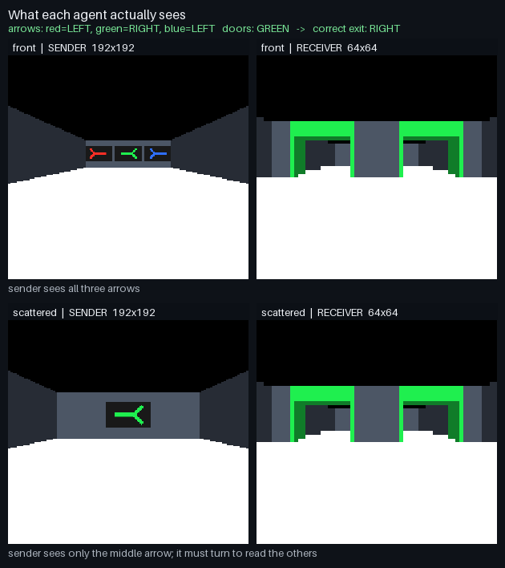
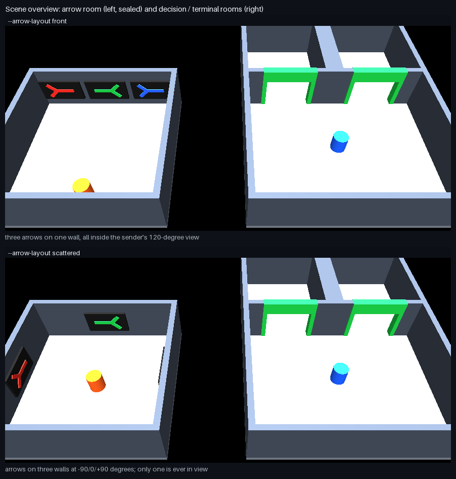
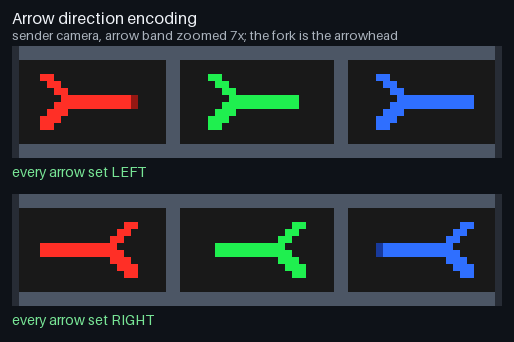
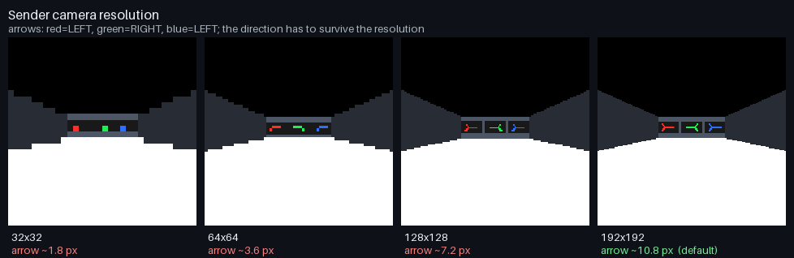
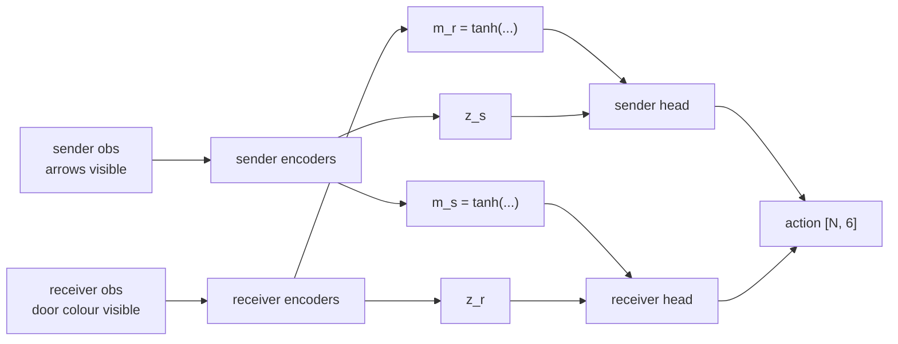

# Two-way communication (`EscapeRoomTwoWayComm-v0`)

A two-agent task where the information needed to act is **split across two sealed rooms**, so neither agent can solve it alone and information has to travel in both directions.

Three arrows — one red, one green, one blue — each point LEFT or RIGHT. Both doorways in the other room are tinted **one** of those three colours. The correct exit is the direction of the arrow whose colour matches the doors:

```
target_direction = arrow_direction[door_colour]        # -1 = LEFT, +1 = RIGHT
```

The sender sees the three arrow directions but not the door colour. The receiver sees the door colour but not the arrows. The rooms share no wall, no line of sight and no physical channel, so the only route between them is the learned message.



Every figure on this page is rendered through the same batched MuJoCo-Warp camera sensors that the pixel observation mode uses, so they show exactly what the policy sees. Regenerate them with `MUJOCO_GL=disable python scripts/render_twowaycomm_docs.py`.


## Scene

| Region | Extent | Contents |
|---|---|---|
| Arrow room | `x ∈ [-14, -6]`, `y ∈ [-4, 4]` | sender, three mocap arrow signs |
| Decision room | `x ∈ [-2, 8]`, `y ∈ [-4, 4]` | receiver spawn at `(3.0, 0.5, 0.45)` |
| Terminal rooms | `y ∈ [4, 9]`, split by a divider at `x = 3` | reached through the doorways |

The wall at `y = 4` leaves two 3.0 m openings centred at `x = 0.5` (LEFT) and `x = 5.5` (RIGHT). Each opening carries three non-colliding tint geoms (a lintel and two jambs, six in total) that are repainted per world with the episode's door colour.

Both agents are free-jointed cylinders (radius 0.4, half-height 0.45, mass 4) carrying a 120°-fovy first-person camera.



### Arrow layouts

Both layouts use the **same scene**; only the sender's spawn differs, which makes the difficulty comparison a controlled one.

| Layout | Sender spawn | Panel distance | Bearings to the three arrows | Visible at spawn |
|---|---|---|---|---|
| `front` | `(-10.0, -2.5, 0.45)` | 6.2–6.7 m | −22.8° / 0° / +22.8° | **all three** |
| `scattered` | `(-10.0, 0.0, 0.45)` | 3.7 m (all three) | −90° / 0° / +90° | **one** |

Under `scattered` the outer arrows sit on the side walls, outside the 120° field of view, so the sender has to turn to read them — which is what makes knowing the door colour *first* worth something.

Direction is carried entirely by each sign's mocap quaternion: the arrow is drawn along the panel's local `+x` and a 180° rotation about `z` flips it. Each wall has a base yaw (`front`: 0/0/0, `scattered`: +90/0/−90) chosen so that "points RIGHT" means the same world direction on every wall — for a viewer facing a panel whose inward normal is `n`, screen-right is `(-n) × ẑ`. The arrow geoms are duplicated on both panel faces so a flipped sign still shows an arrow.



## Observation space

### Vector mode — 14 dimensions per agent

Both agents publish the **same layout**; only the content differs. That is the whole point of the task.

| Index | Content | Normalization | Sender | Receiver |
|---|---|---|---|---|
| 0–1 | local position `x`, `y` | sender `(x+10)/4`, `y/4` · receiver `(x−3)/5`, `y/9` | filled | filled |
| 2–3 | `sin(yaw)`, `cos(yaw)` | — | filled | filled |
| 4–5 | local forward / strafe velocity | `/ max_speed` | filled | filled |
| 6 | yaw rate | `/ max_yaw_rate` | filled | filled |
| 7–9 | `[D_red, D_green, D_blue]` | −1 = LEFT, +1 = RIGHT | filled | **zeros** |
| 10–12 | door-colour one-hot | — | **zeros** | filled |
| 13 | remaining time ratio | `[0, 1]` | filled | filled |

The position constants differ per agent because the two agents stand in different rooms while sharing one observation slot; normalizing each by its own room centre and half-extent puts both in roughly `[-1, 1]`. The receiver's constants are frozen to the one-way scenario's, so indices 0–6 are numerically identical there.

Note that this **drops** the explicit door-direction vectors the one-way receiver had. The doorways are at fixed positions, so navigation is learned from pose.

### Critic group — 28 dimensions, privileged

Both agents' pose blocks plus the **full** arrow directions and door colour. The critic is centralized and discarded at inference, so this is legitimate, and it is what keeps the critic useful in pixel mode.

### Pixel mode

Both private blocks (indices 7–12) are blanked for **both** agents, so the only route to the arrows and the colour is the camera. Two image groups are added:

| Group | Shape | Why this resolution |
|---|---|---|
| `sender_image` | `(B, 3, 192, 192)` | must resolve an arrow subtending ~5.6 % of frame width |
| `receiver_image` | `(B, 3, 64, 64)` | only has to separate three flat colours |

Measured on rendered frames, the arrow glyph is **~1.8 px at 32×32** — the direction is simply not present in the image — and ~11 px at 192. A shared low resolution makes the task unsolvable for the sender no matter how long it trains. mujoco_warp requires `use_textures`, `use_shadows` and `enabled_geom_groups` to agree across cameras, but resolution may differ per camera.




## Action space

Six continuous values, agent-major:

```
[0:3]  sender    [forward, strafe, yaw]
[3:6]  receiver  [forward, strafe, yaw]
```

Each is clamped to `[-1, 1]` twice — once in the action term and once by the wrapper's `clip_actions=1.0`. A single action term owns all six controls, and `RslRlVecEnvWrapper` derives the actor's `output_dim` from `action_manager.total_action_dim`.


## Transition

Controls are applied as a **direct velocity write** into `qvel` (kinematic control, no actuators), once per physics substep, immediately before `sim.step()`:

```
vx = max_speed × (−forward·sin(yaw) + strafe·cos(yaw))
vy = max_speed × ( forward·cos(yaw) + strafe·sin(yaw))
ωz = yaw × max_yaw_rate
vz = ωx = ωy = 0                       # pinned every substep
```

with `max_speed = 8.0` and `max_yaw_rate = 4.0`. Pinning the remaining three degrees of freedom stops the agents falling or tipping, while MuJoCo contacts still resolve normally — **walls genuinely block**, which `test_timeout_penalty_and_sender_motion_never_terminates` asserts by driving the sender at full throttle for 20 steps and checking it is still inside its room. Gravity acts within a step, so the agents settle slightly in `z` and then hold.

Because the second agent rides the batch axis, the two-agent term issues the same number of kernel launches per substep as a one-agent term: one gather and one scatter.

Control step is 0.04 s; `decimation` equals `--physics-substeps` (default 1).


## Reward function

`scale_rewards_by_dt=True` and every term returns a rate divided by `step_dt`, so the division cancels and the values are exact.

| Term | Weight | Fires |
|---|---|---|
| `step` | −0.01 | every step |
| `correct` | +1.0 | entering the matching doorway |
| `wrong` | −10.0 | entering the other doorway |
| `timeout` | −20.0 | horizon reached with no entry |

Totals on the terminal step: **+0.99** correct, **−10.01** wrong, **−20.01** timeout. With default settings this is identical to the one-way scenario.

There is one scalar reward per world per step and both agents' branches are optimized from it — no per-agent credit assignment.

### Optional sender shaping (off by default)

`--sender-shaping-weight` adds a term rewarding the sender for facing the arrow whose colour matches the doors:

```
alignment = max(0, (target_arrow_xy − sender_xy)/‖·‖ · sender_forward)   ∈ [0, 1]
```

This is the only mechanism that makes the sender's own controls affect reward in vector mode. It is disabled at weight 0 (the default), and `--reward-sharing receiver_only` forces every sender-originated term off regardless of its weight.


## Termination

| Condition | Test | Kind |
|---|---|---|
| `correct` | `receiver.y ≥ 4.4` and the entered side matches the target | terminated |
| `wrong` | `receiver.y ≥ 4.4` and the side does not match | terminated |
| `time_out` | 100 control steps | truncated |

The entered side is `receiver.x > 3.0` → RIGHT, otherwise LEFT. The three outcomes are mutually exclusive by construction. **The sender's motion can never end an episode** — only the receiver's pose is read. Horizon is 100 × 0.04 s = 4.0 s with `is_finite_horizon=True`.


## Episode generation

On reset, per reset batch:

- **Arrow directions** — each of the three colour columns is balanced independently: exactly half LEFT and half RIGHT, a coin flip for an odd element, then a shuffle. The three columns are independent, so the eight joint patterns are approximately uniform while each colour's marginal stays exact.
- **Door colour** — exactly `n // 3` of each colour plus a *distinct* random remainder, then a shuffle.
- Both agents are returned to their spawns with zero velocity; the three sign mocap quaternions and positions and the per-world door `geom_rgba` are rewritten.

Balance holds **per reset batch**. During training only terminated worlds reset together, so a single-world reset is an unbiased draw rather than a balanced one. Evaluation removes this caveat by fixing conditions explicitly.


## Communication channel

The message is in neither the observation space nor the action space. It is an internal activation concatenated to the *partner's* hidden latent immediately before that partner's action head, so it never enters an observation tensor, the PPO rollout buffer, or the action manager. There is therefore no "stay silent" option: a message is emitted every step, and all PPO can change is what it encodes.



Two channel modes:

**`same_step`** (default) — both messages are computed from the current observations and delivered within the same step. No circular dependency, because each message depends only on its own agent's observation.

**`delayed`** — each agent consumes the message its partner emitted one step earlier:

```
m_s(t) = tanh(enc_s([o_s(t), m_r(t−1)]))      a_s(t) = head_s(z_s(t), m_r(t−1))
m_r(t) = tanh(enc_r([o_r(t), m_s(t−1)]))      a_r(t) = head_r(z_r(t), m_s(t−1))
```

The incoming message reaching the **message encoder** (`delayed_message_feedback`, on by default) is what makes a query→response protocol possible: the receiver can announce the colour at `t` and the sender can reply with that colour's direction at `t+1`. With feedback disabled the delayed channel is only a one-step-lagged copy of same-step — a useful control, but no dialogue.

Channel widths are set independently with `--sender-message-dim` and `--receiver-message-dim`.


## Configuration

| Flag | Default | Effect |
|---|---|---|
| `--arrow-layout` | `front` | `front` \| `scattered` |
| `--channel-mode` | `same_step` | `same_step` \| `delayed` |
| `--no-delayed-feedback` | off | keeps the partner message out of the message encoder |
| `--obs-mode` | `vector` | `vector` \| `pixel` |
| `--sender-message-dim` | `--message-dim` | sender channel width |
| `--receiver-message-dim` | `--message-dim` | back-channel width |
| `--reward-sharing` | `shared` | `receiver_only` disables sender-originated terms |
| `--sender-shaping-weight` | `0.0` | alignment shaping for the sender |

```bash
escape-room-train --task twowaycomm --arrow-layout front --channel-mode same_step \
  --obs-mode vector --num-envs 8192 --num-updates 1000 --ckpt-dir ckpts/twoway_42

# --episodes must be a multiple of 24 (8 arrow patterns x 3 door colours)
escape-room-evaluate-twowaycomm --ckpt ckpts/twoway_42/model_final.pt --episodes 4800
```


## Evaluation

`evaluate.py` answers "which channel is actually carrying the information", not just "does it solve the task".

- **Balanced conditions** — all 24 joint conditions (8 arrow patterns × 3 door colours) appear exactly `episodes / 24` times, shuffled so condition does not correlate with world index. Each `(colour, answer)` cell is equally frequent, which makes chance-level door choice exactly one half.
- **Per-channel probes** — nearest-centroid, generalized from 2 classes to K. The sender's message is probed for each arrow direction *and* for the queried direction; the receiver's for the 3-class door colour. The gap between mean per-arrow accuracy and queried-direction accuracy is the measurement of whether a query→response code emerged.
- **Independent ablations** — `zero_sender`, `zero_receiver`, `zero_both`, `shuffle_sender`, `shuffle_receiver`, each with its own permutation. Headline numbers are `forward_channel_effect` and `back_channel_effect`.

Artifacts are written beside the checkpoint: `<ckpt>.evaluation.json` and `<ckpt>.message_probe.json` (schema v2, one block per channel).


## Known limitation

**In `same_step` + `vector` the back-channel is structurally unidentified, not merely vestigial.** The sender's message cannot depend on the receiver's within a step, and the sender's *actions* do not affect reward, so the only gradient into `receiver_message_encoder` flows through an advantage signal that is pure noise with respect to the sender's actions. The gradient-flow test still passes — the path exists — but training leaves the channel meaningless (receiver probe near chance, `zero_receiver ≈ normal`).

Four knobs give it a job: narrowing `--sender-message-dim` so three directions no longer fit, `--sender-shaping-weight` so the sender's motion matters, `scattered` + `pixel` so the sender physically cannot see all three arrows at once, and `delayed` so it can answer rather than broadcast. The evaluation is built so a null back-channel effect reads as a clean result rather than a bug.


## Implementation notes

Facts that are load-bearing and easy to get wrong:

- **Per-world door colour needs an event term.** `paint_door_colors` carries `@requires_model_fields("geom_rgba")`, which is the only thing that makes mjlab expand the array from `(1, ngeom, 4)` to `(num_envs, ngeom, 4)`. The tint geoms must also carry no material, since `geom_rgba` is ignored when `matid != -1`. Both are asserted at construction.
- **Reset events run before `ActionManager.reset`.** So the action term does the authoritative paint inside its own `reset()`, and the event term is only the expansion hook plus an idempotent repaint. For the same reason `door_color` is initialized with zeros rather than `torch.empty` — the event reads it before the first reset.
- **Passing `events=` overrides the dataclass default**, so `reset_scene_to_default` has to be re-listed or entities stop returning to their initial state. That default also teleports mocap bodies to their initial state, which is why sign positions are rewritten every reset.
- **The delayed hidden state must be 3-D.** rsl-rl stores it as `[T, 1, N, M]` and does `permute(2, 0, 1, 3)`; a 2-D state raises. Three further traps are handled: the storage sizes its buffers from the hidden state recorded *before* the first forward (so the buffers are sized from the constructor's observations), the state comes back as an inference tensor and must be cloned before autograd, and batch replay must not write the persistent buffers because `n_traj ≠ num_envs`. `test_hidden_state_round_trips_through_rollout_storage` drives a real `RolloutStorage` to pin all of this.
- **`rnn_type` must stay `None`** in the model config, or mjlab forwards three `rnn_*` kwargs the actor does not accept.
- **A checkpoint records its channel mode** in a persistent `channel_mode_code` buffer, because without feedback the two modes have identical parameter shapes and a delayed checkpoint would otherwise load cleanly as same-step.
- **Vector mode registers no camera sensors at all**, so `sim.sense()` returns immediately and rendering costs nothing.
- `nconmax`/`njmax` are set to 48/192 — twice the one-way scenario's, for the second mobile agent. Reasoned, not yet benchmarked.


## Files

```
scene.py      arena, both agents, cameras, arrow signs, door tint geoms
action.py     TwoWayCommAction — owns all game state; manager thunks at the bottom
env_cfg.py    manager wiring, camera sensors, TwoWayDialModelCfg, runner config
env.py        TwoWayCommRlEnv, make_env, gym registration
model.py      TwoWayDialActor — both channel modes, CNN path for pixel mode
evaluate.py   balanced conditions, per-channel probes, independent ablations
```

Figures live in `images/` and are regenerated by
`scripts/render_twowaycomm_docs.py`.

Tests: `tests/test_twowaycomm_{env,model,evaluate}.py` — CPU only, seconds.
