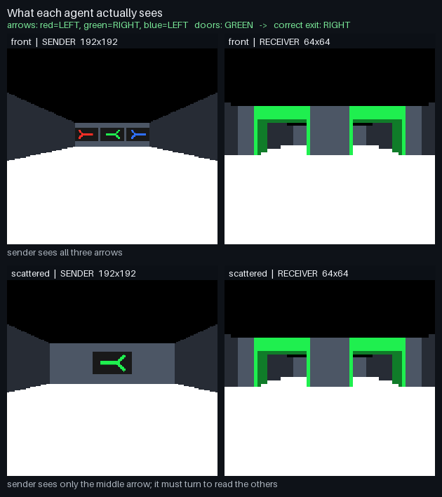
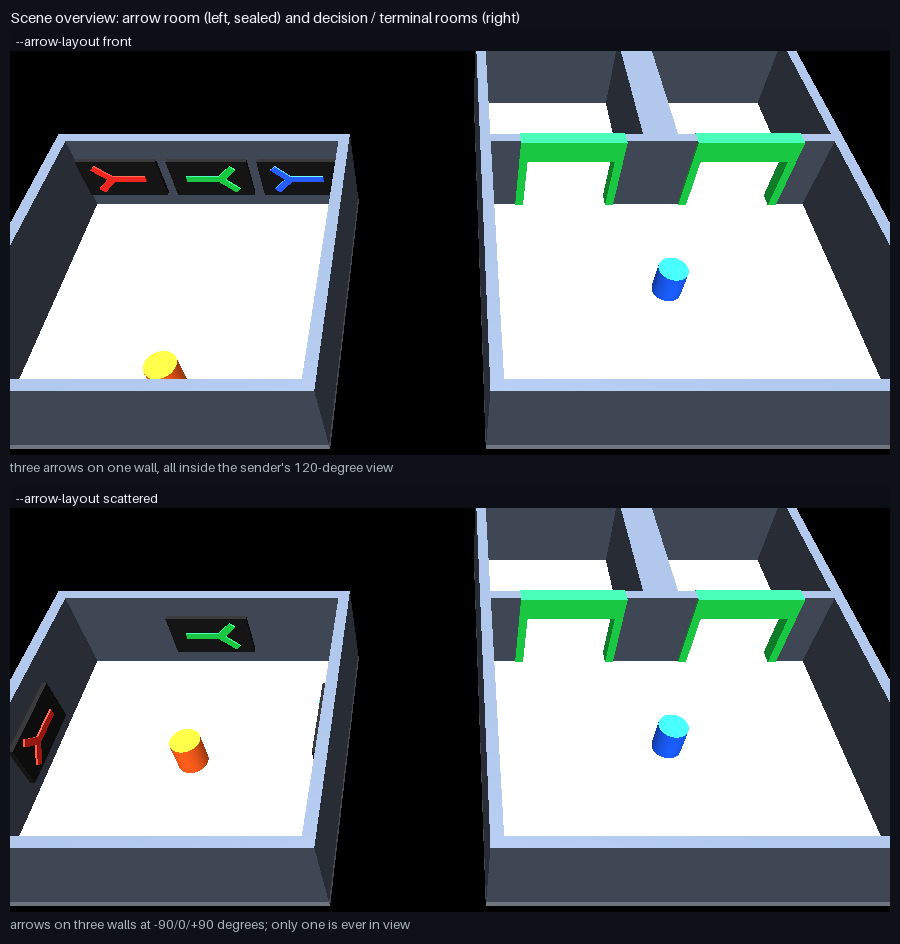
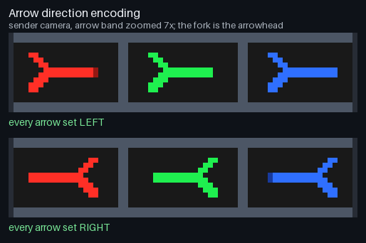
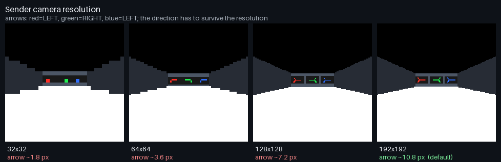
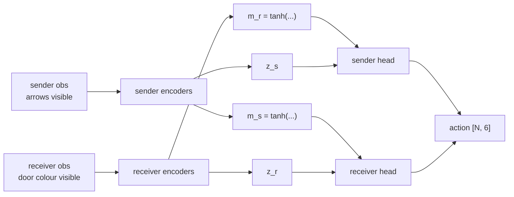

# Two-way communication (`EscapeRoomTwoWayComm-v0`)

A two-agent task where the information needed to act is **split across two sealed rooms**, so neither agent can solve it alone and information has to travel in both directions.

Three arrows — one red, one green, one blue — each point LEFT or RIGHT. Both doorways in the other room are tinted **one** of those three colours. The correct exit is the direction of the arrow whose colour matches the doors:

```
target_direction = arrow_direction[door_colour]        # -1 = LEFT, +1 = RIGHT
```

The sender sees the three arrow directions but not the door colour. The receiver sees the door colour but not the arrows. The rooms share no wall, no line of sight and no physical channel, so the only route between them is the learned message.



Every figure on this page is rendered through the same batched MuJoCo-Warp camera sensors that the pixel observation mode uses, so they show exactly what the policy sees. Regenerate them with `MUJOCO_GL=disable python scripts/render_twowaycomm_docs.py`.


## Scene

| Region | Extent | Contents |
|---|---|---|
| Arrow room | `x ∈ [-14, -6]`, `y ∈ [-4, 4]` | sender, three mocap arrow signs |
| Decision room | `x ∈ [-2, 8]`, `y ∈ [-4, 4]` | receiver spawn at `(3.0, 0.5, 0.45)` |
| Terminal rooms | `y ∈ [4, 9]`, split by a divider at `x = 3` | reached through the doorways |

The wall at `y = 4` leaves two 3.0 m openings centred at `x = 0.5` (LEFT) and `x = 5.5` (RIGHT). Each opening carries three non-colliding tint geoms (a lintel and two jambs, six in total) that are repainted per world with the episode's door colour.

Both agents are free-jointed cylinders (radius 0.4, half-height 0.45, mass 4) carrying a 120°-fovy first-person camera.



### Arrow layouts

Both layouts use the same room geometry. The arrow panel positions and base orientations, as well as the sender's spawn, differ: `front` places all three panels on the front wall, whereas `scattered` places them on the left, front and right walls. Vector observations still expose all three directions in either layout; camera observations depend on visibility.

| Layout | Sender spawn | Panel distance | Bearings to the three arrows | Visible at spawn |
|---|---|---|---|---|
| `front` | `(-10.0, -2.5, 0.45)` | 6.2–6.7 m | −22.8° / 0° / +22.8° | **all three** |
| `scattered` | `(-10.0, 0.0, 0.45)` | 3.7 m (all three) | −90° / 0° / +90° | **one** |

Under `scattered` the outer arrows sit on the side walls, outside the 120° field of view, so the sender has to turn to read them — which is what makes knowing the door colour *first* worth something.

Direction is carried entirely by each sign's mocap quaternion: the arrow is drawn along the panel's local `+x` and a 180° rotation about `z` flips it. Each wall has a base yaw (`front`: 0/0/0, `scattered`: +90/0/−90) chosen so that "points RIGHT" means the same world direction on every wall — for a viewer facing a panel whose inward normal is `n`, screen-right is `(-n) × ẑ`. The arrow geoms are duplicated on both panel faces so a flipped sign still shows an arrow.



## Observation space

### Vector mode — 14 dimensions per agent

Both agents publish the **same layout**; only the content differs. That is the whole point of the task.

| Index | Content | Normalization | Sender | Receiver |
|---|---|---|---|---|
| 0–1 | local position `x`, `y` | sender `(x+10)/4`, `y/4` · receiver `(x−3)/5`, `y/9` | filled | filled |
| 2–3 | `sin(yaw)`, `cos(yaw)` | — | filled | filled |
| 4–5 | local forward / strafe velocity | `/ max_speed` | filled | filled |
| 6 | yaw rate | `/ max_yaw_rate` | filled | filled |
| 7–9 | `[D_red, D_green, D_blue]` | −1 = LEFT, +1 = RIGHT | filled | **zeros** |
| 10–12 | door-colour one-hot | — | **zeros** | filled |
| 13 | remaining time ratio | `[0, 1]` | filled | filled |

The position constants differ per agent because the two agents stand in different rooms while sharing one observation slot; normalizing each by its own room centre and half-extent puts both in roughly `[-1, 1]`. The receiver's constants are frozen to the one-way scenario's, so indices 0–6 are numerically identical there.

Note that this **drops** the explicit door-direction vectors the one-way receiver had. The doorways are at fixed positions, so navigation is learned from pose.

### Critic group — 28 dimensions, privileged

Both agents' pose blocks plus the **full** arrow directions and door colour. Vector-observation MAPPO uses this centralized state. Pixel-observation MAPPO uses the image critic described below by default; `--critic-obs-mode vector` selects this privileged state for its critic. Actors cannot read these labels in pixel mode, and the critic is discarded at inference.

### Pixel mode

Both private blocks (indices 7–12) are blanked for **both** agents, so the only route to the arrows and the colour is the camera. Two image groups are added:

| Group | Shape | Why this resolution |
|---|---|---|
| `sender_image` | `(B, 3, 192, 192)` | must resolve an arrow subtending ~5.6 % of frame width |
| `receiver_image` | `(B, 3, 64, 64)` | only has to separate three flat colours |

At the initial front pose, the arrow glyph is **~1.8 px at 32×32** and ~11 px at 192. At low resolution its direction can disappear at that distance. Moving closer increases the number of pixels covering the glyph, so low resolution does not make the entire mobile task intrinsically unsolvable. mujoco_warp requires `use_textures`, `use_shadows` and `enabled_geom_groups` to agree across cameras, but resolution may differ per camera.

### Shared-resolution pixels and recurrent MAPPO critic

`escape-room-train --task twowaycomm --algorithm mappo --obs-mode pixel --pixel-size {32,64,192}` gives both agents the selected RGB resolution (CLI default 64). Vector runs are unchanged. The lower-level environment API also accepts `pixel_size`; leaving it unset retains the legacy asymmetric camera defaults.

For large pixel observations, `--release-cuda-cache` returns unused PyTorch allocations after each update so that MuJoCo-Warp can allocate its simulation buffers. It does not change network parameters, gradients, or the update equations. The 192px experiments use this option and a smaller rollout batch; compare their recorded environment counts and update counts alongside their resolution.

`--resume-checkpoint PATH` restores the actor, critic, optimizers and normalizers. When changing the environment count, completed world transitions are converted to the new batch size; `--num-updates` specifies the total target, including those completed transitions. Environments and recurrent rollout memory start fresh. The 192px retry coordinator reduces the environment count after CUDA OOM, resumes a checkpoint, and retains the newest 12 checkpoints in its own experiment directory.

Pixel MAPPO uses a `PixelGruCritic` with two critic-only CNNs (channels 16/32, kernels 5/3, strides 2/2, ELU). Their flattened features are concatenated with 15 auxiliary fields: seven position/orientation/velocity fields from each agent, and a single remaining-time field. A linear projection and ELU feed a one-layer 256-wide GRU. Its shared central memory is concatenated with each agent's one-hot ID before the shared value MLP produces two values. The critic never reads privileged arrow/colour labels or the `critic` observation group. Actor and critic CNNs and optimizers are separate.

Recurrent rollout memory is reset per terminated world and retained across rollout boundaries. Sequence minibatches replay saved initial memories, with padding masks and truncated BPTT, without replacing live rollout memory. Bootstrap value evaluation peeks at the next frame without advancing memory. All checkpoints save environment and model configuration in `infos.twowaycomm`; `training_config.json` is also written next to them. Evaluation and playback restore pixel size and layout automatically. Evaluation accepts `--num-envs` to batch episodes (pixel default 96) without allocating all 4800 worlds at once.

The 2026-10-05 experiment grid is 32/64 pixels × front/scattered, seed 42, delayed feedback, two tanh message coordinates per direction, 256 worlds × 32 steps × 2000 updates (16,384,000 world transitions per run), GPU 2 only. Completion and results belong to the generated experiment artifacts, not this configuration description.

### Pixel actor with a vector state critic

`--critic-obs-mode vector` is available only for `--task twowaycomm --algorithm mappo --obs-mode pixel`. It selects `VectorGruCritic`: empirical normalization of the 28D privileged state, a linear projection with ELU, the same 256-wide GRU and the same agent-conditioned value head. It does not contain CNNs. The actor, its private-image inputs and message channel are unchanged. Omitting the option retains the original critic selection; `--critic-obs-mode pixel` explicitly selects the image critic.

The matched GPU-2 experiment queue is `scripts/run_pixel_vector_critic.py`. It freezes the source into its experiment directory, re-evaluates the original 64px front/scattered checkpoints with fresh initial camera images, and trains the vector-critic versions from scratch. Each run uses seed 42 and 256 worlds × 32 steps × 2000 updates. Final checkpoints receive a balanced 4800-episode evaluation and the communication/feature diagnostics below. Status, source hashes, logs and comparisons are saved under `ckpts/twoway_comm/pixel_vector_critic_20261007/`. This is a single-seed control.

### Communication and frozen-feature diagnostics

`python -m escape_room.twowaycomm.pixel_diagnostics` measures the six completed arrow-task pixel checkpoints by default. It supports `--checkpoints`, `--output-dir`, `--mc-samples` and `--probe-poses TRAIN VALIDATION TEST`. CUDA runs require `CUDA_VISIBLE_DEVICES=2`; use `MUJOCO_GL=disable` and the repository virtual environment.

The continuous-channel adaptation of [Lowe et al. (2019)](https://arxiv.org/abs/1903.05168) reports speaker consistency (SC: message/own-next-action mutual information), task-label/message mutual information, and local causal influence (CIC: intervention on the incoming message while holding the listener's observations and history fixed). Tanh messages use 4/8/16 equal-width bins per coordinate; SC integrates the clipped Gaussian action distribution into three bins per control. Local CIC uses 256 Monte Carlo draws per alternative private visual condition. Private arrows or door colour are changed at the observed camera pose to generate in-distribution alternative messages. The feedback path through the partner's reply to the original speaker's action two steps later is measured separately. This is a local intervention, not a counterfactual episode rollout or a task-success improvement measure.

Communication is measured at t=0,1,2,4,8,16,32,64 in a balanced census of 24 task conditions. Late samples can be selected by episode survival, so each result includes `n_active`. SC and task MI include message-permutation null controls; finite-sample corrected estimates can be negative. Identical-message CIC and unchanged-private-condition controls are asserted. Frozen actor parameters are checked after measurement. Alternative private visuals hold earlier messages fixed, so CIC describes current message sensitivity at the observed history, rather than sensitivity after a whole alternate task history.

Feature probes fit a linear ridge classifier to the frozen actor CNN's flattened output, with train-only scaling and validation-only regularization selection. Training, validation and test use different camera poses (default 8/4/8); confidence intervals resample test poses. Sender targets are the three colour-specific arrow directions, and the receiver target is door colour. Far and near views are tested, alongside raw RGB and an untrained CNN with the same architecture. In `scattered`, the camera is manually aimed at each designated wall, so these probes measure information retained when that wall is visible, rather than whether the learned policy turns to see it. A successful probe establishes linear accessibility; it does not establish that the learned policy uses that information.




## Action space

Six continuous values, agent-major:

```
[0:3]  sender    [forward, strafe, yaw]
[3:6]  receiver  [forward, strafe, yaw]
```

Each is clamped to `[-1, 1]` twice — once in the action term and once by the wrapper's `clip_actions=1.0`. A single action term owns all six controls, and `RslRlVecEnvWrapper` derives the actor's `output_dim` from `action_manager.total_action_dim`.


## Transition

Controls are applied as a **direct velocity write** into `qvel` (kinematic control, no actuators), once per physics substep, immediately before `sim.step()`:

```
vx = max_speed × (−forward·sin(yaw) + strafe·cos(yaw))
vy = max_speed × ( forward·cos(yaw) + strafe·sin(yaw))
ωz = yaw × max_yaw_rate
vz = ωx = ωy = 0                       # pinned every substep
```

with `max_speed = 8.0` and `max_yaw_rate = 4.0`. Pinning the remaining three degrees of freedom stops the agents falling or tipping, while MuJoCo contacts still resolve normally — **walls genuinely block**, which `test_timeout_penalty_and_sender_motion_never_terminates` asserts by driving the sender at full throttle for 20 steps and checking it is still inside its room. Gravity acts within a step, so the agents settle slightly in `z` and then hold.

Because the second agent rides the batch axis, the two-agent term issues the same number of kernel launches per substep as a one-agent term: one gather and one scatter.

Control step is 0.04 s; `decimation` equals `--physics-substeps` (default 1).


## Reward function

`scale_rewards_by_dt=True` and every term returns a rate divided by `step_dt`, so the division cancels and the values are exact.

| Term | Weight | Fires |
|---|---|---|
| `step` | −0.01 | every step |
| `correct` | +1.0 | entering the matching doorway |
| `wrong` | −10.0 | entering the other doorway |
| `timeout` | −20.0 | horizon reached with no entry |

Totals on the terminal step: **+0.99** correct, **−10.01** wrong, **−20.01** timeout. With default settings this is identical to the one-way scenario.

There is one scalar reward per world per step. With `--algorithm ppo` both agents' branches are optimized from it, with no per-agent credit assignment. The environment also publishes `extras["agent_rewards"]` (`[num_envs, 2]`, sender then receiver), which MAPPO reads (see [Training algorithms](#training-algorithms)).

### Optional sender shaping (off by default)

`--sender-shaping-weight` adds a term rewarding the sender for facing the arrow whose colour matches the doors:

```
alignment = max(0, (target_arrow_xy − sender_xy)/‖·‖ · sender_forward)   ∈ [0, 1]
```

This is the only mechanism that makes the sender's own controls affect reward in vector mode. It is disabled at weight 0 (the default), and `--reward-sharing receiver_only` forces every sender-originated term off regardless of its weight.

`--reward-sharing individual` keeps the scalar reward identical to `shared`, but its per-agent split gives the shaping bonus to the sender only: `agent_rewards = [r, r − w·alignment]`. Only a per-agent learner can tell the two modes apart, so `train.py` accepts `individual` only with `--algorithm mappo`.


## Termination

| Condition | Test | Kind |
|---|---|---|
| `correct` | `receiver.y ≥ 4.4` and the entered side matches the target | terminated |
| `wrong` | `receiver.y ≥ 4.4` and the side does not match | terminated |
| `time_out` | 100 control steps | truncated |

The entered side is `receiver.x > 3.0` → RIGHT, otherwise LEFT. The three outcomes are mutually exclusive by construction. **The sender's motion can never end an episode** — only the receiver's pose is read. Horizon is 100 × 0.04 s = 4.0 s with `is_finite_horizon=True`.


## Episode generation

On reset, per reset batch:

- **Arrow directions** — each of the three colour columns is balanced independently: exactly half LEFT and half RIGHT, a coin flip for an odd element, then a shuffle. The three columns are independent, so the eight joint patterns are approximately uniform while each colour's marginal stays exact.
- **Door colour** — exactly `n // 3` of each colour plus a *distinct* random remainder, then a shuffle.
- Both agents are returned to their spawns with zero velocity; the three sign mocap quaternions and positions and the per-world door `geom_rgba` are rewritten.

Balance holds **per reset batch**. During training only terminated worlds reset together, so a single-world reset is an unbiased draw rather than a balanced one. Evaluation removes this caveat by fixing conditions explicitly.


## Communication channel

The message is in neither the observation space nor the action space. It is an internal activation concatenated to the *partner's* hidden latent immediately before that partner's action head, so it never enters an observation tensor, the PPO rollout buffer, or the action manager. There is therefore no "stay silent" option: a message is emitted every step, and all PPO can change is what it encodes.


```mermaid
flowchart LR
    OS["sender obs<br/>arrows visible"] --> ES["sender encoders"]
    OR["receiver obs<br/>door colour visible"] --> ER["receiver encoders"]
    ES --> MS["m_s = tanh(...)"]
    ER --> MR["m_r = tanh(...)"]
    ES --> ZS["z_s"]
    ER --> ZR["z_r"]
    MR --> HS["sender head"]
    ZS --> HS
    MS --> HR["receiver head"]
    ZR --> HR
    HS --> A["action [N, 6]"]
    HR --> A
```

Two channel modes:

**`same_step`** (default) — both messages are computed from the current observations and delivered within the same step. No circular dependency, because each message depends only on its own agent's observation.

**`delayed`** — each agent consumes the message its partner emitted one step earlier:

```
m_s(t) = tanh(enc_s([o_s(t), m_r(t−1)]))      a_s(t) = head_s(z_s(t), m_r(t−1))
m_r(t) = tanh(enc_r([o_r(t), m_s(t−1)]))      a_r(t) = head_r(z_r(t), m_s(t−1))
```

The incoming message reaching the **message encoder** (`delayed_message_feedback`, on by default) is what makes a query→response protocol possible: the receiver can announce the colour at `t` and the sender can reply with that colour's direction at `t+1`. With feedback disabled the delayed channel is only a one-step-lagged copy of same-step — a useful control, but no dialogue.

Channel widths are set independently with `--sender-message-dim` and `--receiver-message-dim`.

### Message unit: tanh or DIAL's DRU

`--message-unit` decides what function the raw encoder output `m` goes through:

| Unit | Training (`actor.train()`) | Execution (`actor.eval()`, evaluate, play, export) |
|---|---|---|
| `tanh` (default) | `tanh(m + σε)`, σ = 0 by default | `tanh(m)` |
| `dru` | `sigmoid(m + σε)`, σ = 2 by default | `1{m > 0}`, a hard bit |
| `dru_st` | hard bit `1{m + σε > 0}` forward, sigmoid gradient backward (σ = 0 by default) | `1{m > 0}` |

The DRU is the discretise/regularise unit from DIAL (Foerster et al., 2016). Training noise pushes the encoder towards saturated logits, so that thresholding them at execution time changes almost nothing the partner receives. Evaluation therefore measures a **discrete** protocol. `Comm/message_saturation_*` in the training logs reports the fraction of training messages already outside `(0.1, 0.9)`, which tells you whether the protocol is ready to be binarized. `Comm/sigmoid_grad_mean_*` reports `σ'(m)`, the learning signal a DRU still passes, which falls to zero as the logits saturate. `--message-noise-std` overrides σ.

The straight-through unit, `dru_st`, sends the execution-time bit during training too, so the partner never sees a soft message, and it back-propagates through the sigmoid as if the bit were soft. Nothing in it rewards saturated logits. That is the point: in the first MAPPO + DRU run, saturation reached 1.0 by update 200, and accuracy stayed at 79–83% from then on.

**The noise is recorded, not resampled.** `ε` is part of the policy's input. If the update drew new noise, the first-epoch PPO ratio would already differ from 1 for reasons unrelated to the parameters. Both learners (`DialPPO` and `MAPPO`) therefore draw `ε` once per step, attach it to the observation as `message_noise`, and let the rollout storage record it. The update replays the same draw. Because the recurrent minibatch generator pads observations per trajectory, the replay stays step-aligned in `delayed` mode too. With σ = 0, no key is added and `DialPPO` is numerically identical to rsl-rl PPO.

**Measured** (MAPPO with adaptive LR, `delayed` + `front`, 3 seeds × 1000 updates, 4800 evaluation episodes each; W&B groups `dru-variants-delayed` and `stability-tanh-delayed`):

| Unit | Final accuracy per seed | Seeds at 24/24 | Back-channel effect | `σ'(m)` at the end |
|---|---|---|---|---|
| `tanh` | 1.000 / 1.000 / 1.000 | 3 | 0.31 / 0.33 / 0.31 | — |
| `dru`, σ = 2 | 1.000 / 0.916 / 0.958 | 1 | 0.30 / 0.10 / 0.10 | 0.004–0.008 |
| `dru`, σ = 1 | 0.958 / 0.498 / 1.000 | 1 | 0.18 / 0.00 / 0.32 | 0.000–0.021 |
| `dru`, σ = 0.5 | 1.000 / 0.917 / 1.000 | 2 | 0.20 / 0.16 / 0.27 | 0.023–0.037 |
| `dru_st`, σ = 0 | 0.958 / 0.917 / 0.958 | 0 | 0.24 / 0.18 / 0.28 | 0.019–0.025 |

How to read the table:

- **No binary variant matches `tanh` reliably.** The differences between DRU variants amount to one condition out of 24 per seed, which three seeds cannot resolve.
- **The plain DRU's failure mode is real.** In σ = 1 seed 43, the channel saturated within 50 updates, before any protocol had formed. `σ'(m)` fell to 0.009, and accuracy stayed at chance with `forward_channel_effect` = 0.
- **Lower σ leaves more gradient.** That is visible in the last column.
- **`dru_st` stalls through the adaptive schedule.** A tiny parameter change can flip a bit, so KL stays above target even at the minimum learning rate. The schedule therefore pins the rate at 1e-5 (seed 43 from update 200 onwards), and learning stops at 22–23/24.
- **Remaining DRU failures are mostly not code collisions.** The sender's bit sequence for the failing condition differs from every condition that needs the other answer. The receiver nevertheless wanders for about 90 steps before entering the wrong door. A first, fixed-LR DRU run did fail by collision, with only 6 distinct sender sequences for 24 conditions. Under the adaptive schedule the same seed reaches 24/24.

A checkpoint records its unit in a persistent `message_unit_code` buffer. A checkpoint from before the DRU existed has no such buffer and loads as `tanh`.


## Training algorithms

`--algorithm` selects the learner. Both learners train the same actor, and they differ in what they optimize.

| | `ppo` (default) | `mappo` |
|---|---|---|
| Policy ratio | one joint ratio `r_s·r_r`, clipped jointly | **per-agent** ratio, clipped per agent, loss averaged over agents |
| Critic | one team value `V(s)` | **`V_i(s)` per agent**: privileged state + one-hot agent id, one shared MLP |
| Rewards / GAE | scalar | **per agent** (`extras["agent_rewards"]`), GAE and advantage normalization per agent |
| Value target | raw returns, clipped MSE | **ValueNorm** (debiased running mean/var per agent), clipped Huber (δ = 10) |
| Optimizers | one, over actor + critic | **separate** actor and critic optimizers, each with its own gradient clip |
| Defaults | adaptive LR, the CLI's historical PPO values | **adaptive** LR from 3e-4, 5 epochs, grad clip 10, entropy 0.005 |

MAPPO follows Yu et al., *The Surprising Effectiveness of PPO in Cooperative Multi-Agent Games* (NeurIPS 2022). Execution stays decentralized: each head sees only its own latent and its partner's message. The message is still a differentiable activation, so the receiver's surrogate back-propagates into the sender's message encoder and vice versa. That is DIAL's cross-agent gradient, and `test_each_agents_surrogate_trains_its_partners_message_encoder` checks it in both channel modes.

Why per-agent clipping matters: suppose the sender's ratio has drifted to 1.5 while the receiver's is 1.1. Their product, 1.65, is clipped, so joint-ratio PPO stops updating the receiver as well. MAPPO clips only the sender.

Under the shared reward both agents receive the same reward. Their advantages still differ, because each agent's value baseline differs. With `--reward-sharing individual`, a bonus earned by the sender alone enters only the sender's advantage.

**Why the learning rate is adaptive.** The MAPPO paper uses a fixed rate, and this implementation first did too. On `tanh` + `delayed` + `front` (3 seeds × 1000 updates, W&B group `stability-tanh-delayed`) the outcomes were:

| Schedule | Final accuracy per seed | Back-channel effect | What went wrong |
|---|---|---|---|
| fixed 3e-4 | 0.917 / 0.792 / 0.792 | 0.20 / 0.03 / 0.06 | one run reached 1.0 and then collapsed after a single update with KL 0.22; two stalled at 19/24 conditions |
| fixed + `--max-kl 0.02` | 0.792 / 0.958 / 0.748 | 0.13 / 0.28 / 0.04 | early stopping cannot raise the rate, so the stalls remain |
| **adaptive** | **1.000 / 1.000 / 1.000** | **0.31 / 0.33 / 0.31** | none |

The adaptive schedule raises the rate to about 1e-2 within the first 30 updates, which escapes the stall. Later it lowers the rate to 3e-5–3e-4 as the receiver's action std shrinks, and a shrinking std is what turns a fixed step into a KL spike. The schedule follows the larger of the two per-agent KLs.

MAPPO-specific flags: `--critic-lr`, `--value-loss {huber,mse}`, `--no-value-norm`, `--max-kl` (KL early stopping, off by default), and `--lr-schedule {adaptive,fixed}`, which applies to both learners. The generic PPO flags (`--lr`, `--num-epochs`, `--entropy-coef`, ...) override the MAPPO defaults only when given explicitly. Under `--algorithm ppo` they keep their historical behaviour of always overriding the task configuration.

Logged under `Loss/MAPPO/`: `surrogate_*`, `value_*`, `entropy_*`, `kl_*`, `clip_fraction_*`, `return_mean_*`, `advantage_std_*` (before normalization) for `sender` and `receiver`, plus `critic_learning_rate`. With the adaptive schedule, the larger of the two per-agent KLs sets the step size.

MAPPO does not change the known limitation below. In `same_step` + `vector` the sender's actions still do not affect the reward, so per-agent advantages give the back-channel nothing to learn from. `individual` + `--sender-shaping-weight` and `delayed` are the settings aimed at that problem.

Measured cost (RTX 4090, 4096 worlds, 5 epochs for both learners): 238k vs 258k env SPS in `same_step` (−8%), and 95k (`mappo` + `dru`) vs 106k (`ppo` + `tanh`) in `delayed` (−11%).

### Logging to Weights & Biases

`--logger wandb` writes TensorBoard event files and a W&B run at the same time. The run includes every loss above, `Episode_Metrics/{correct,wrong,timeout}`, per-term `Episode_Reward/*`, `Train/mean_reward`, `Perf/*` and the full train/env config. The `Comm/*` channel diagnostics are logged for both learners.

```bash
escape-room-train --task twowaycomm --algorithm mappo --message-unit dru --channel-mode delayed \
  --logger wandb --wandb-project escape-room --run-name mappo_dru_delayed_42 \
  --num-envs 4096 --num-updates 1000 --device cuda:0 --ckpt-dir ckpts/mappo_dru_delayed_42
```

`--wandb-entity`, `--wandb-group` and `--wandb-tags` are optional, and the run name defaults to the checkpoint directory's name. `escape_room/wandb_writer.py` replaces rsl-rl's writer for three reasons. rsl-rl's writer passes `Settings(start_method=...)`, which the pinned wandb 0.30 rejects. It logs `*/time` scalars indexed by seconds, which would break W&B's monotonically increasing step. And it uploads after the run has finished, which happens when `train.py` writes `model_final.pt`.


## Configuration

| Flag | Default | Effect |
|---|---|---|
| `--arrow-layout` | `front` | `front` \| `scattered` |
| `--channel-mode` | `same_step` | `same_step` \| `delayed` |
| `--no-delayed-feedback` | off | keeps the partner message out of the message encoder |
| `--obs-mode` | `vector` | `vector` \| `pixel` |
| `--sender-message-dim` | `--message-dim` | sender channel width |
| `--receiver-message-dim` | `--message-dim` | back-channel width |
| `--reward-sharing` | `shared` | `receiver_only` disables sender-originated terms; `individual` credits them to the sender alone (MAPPO) |
| `--sender-shaping-weight` | `0.0` | alignment shaping for the sender |
| `--algorithm` | `ppo` | `ppo` \| `mappo` |
| `--message-unit` | `tanh` | `tanh` \| `dru` |
| `--message-noise-std` | `0` / `2` | channel training noise (tanh / dru default) |
| `--logger` | `tensorboard` | `tensorboard` \| `wandb` |

```bash
escape-room-train --task twowaycomm --arrow-layout front --channel-mode same_step \
  --obs-mode vector --num-envs 8192 --num-updates 1000 --ckpt-dir ckpts/twoway_42

# --episodes must be a multiple of 24 (8 arrow patterns x 3 door colours)
escape-room-evaluate-twowaycomm --ckpt ckpts/twoway_42/model_final.pt --episodes 4800
```


## Evaluation

`evaluate.py` answers "which channel is actually carrying the information", not just "does it solve the task".

- **Balanced conditions** — all 24 joint conditions (8 arrow patterns × 3 door colours) appear exactly `episodes / 24` times, shuffled so condition does not correlate with world index. Each `(colour, answer)` cell is equally frequent, which makes chance-level door choice exactly one half.
- **Per-channel probes** — nearest-centroid, generalized from 2 classes to K. The sender's message is probed for each arrow direction *and* for the queried direction; the receiver's for the 3-class door colour. The gap between mean per-arrow accuracy and queried-direction accuracy is the measurement of whether a query→response code emerged.
- **Independent ablations** — `zero_sender`, `zero_receiver`, `zero_both`, `shuffle_sender`, `shuffle_receiver`. Each cuts its channel on **every path the partner reads it on**: the partner's action head and, in `delayed` mode with feedback, the partner's message encoder. A shuffle draws one fixed derangement per channel per rollout, so a world hears one consistent stranger for the whole episode.
- **Path decomposition** — `shuffle_{sender,receiver}_head_only` cuts only the action-head path, and `shuffle_{sender,receiver}_feedback_only` (offered only when feedback exists) cuts only the message-encoder path.
- **Headline numbers** — `forward_channel_effect` and `back_channel_effect` are the accuracy lost under the all-path shuffles, and each has `_head_only` and `_feedback_only` variants. The headlines use shuffles rather than zeros because, for a DRU, the all-zeros code is a valid message.

**Why the paths matter.** A query→response protocol travels through feedback: the receiver's message changes what the sender *says*. It does not change what the sender *does*, and the sender's actions never affect the reward. An ablation that only cuts the sender's action head therefore reads zero by construction. Evaluations before `ablation_version` 2 did exactly that. Their `zero_receiver` arm is today's `zero_receiver` restricted to the head path, and it reported a back-channel effect of 0 for every checkpoint. Re-evaluated with all paths cut, the MAPPO + tanh + delayed checkpoint loses 29 points.

Artifacts are written beside the checkpoint: `<ckpt>.evaluation.json` and `<ckpt>.message_probe.json` (schema v2, one block per channel).

For a DRU checkpoint, evaluation runs on hard bits, so `zero_*` replaces the message with the all-zeros code. That is a valid message, not silence. The `shuffle_*` arms are the cleaner control.


## Known limitation

**In `same_step` + `vector` the back-channel is structurally unidentified, not merely vestigial.** The sender's message cannot depend on the receiver's within a step, and the sender's *actions* do not affect reward, so the only gradient into `receiver_message_encoder` flows through an advantage signal that is pure noise with respect to the sender's actions. The gradient-flow test still passes — the path exists — but training leaves the channel meaningless (receiver probe near chance, `zero_receiver ≈ normal`).

Four knobs give it a job: narrowing `--sender-message-dim` so three directions no longer fit, `--sender-shaping-weight` so the sender's motion matters, `scattered` + `pixel` so the sender physically cannot see all three arrows at once, and `delayed` so it can answer rather than broadcast. In `same_step` mode a null `back_channel_effect` is the expected result. In `delayed` mode with feedback, check `back_channel_effect_feedback_only`, because that is the path a dialogue uses.


## Implementation notes

Facts that are load-bearing and easy to get wrong:

- **Per-world door colour needs an event term.** `paint_door_colors` carries `@requires_model_fields("geom_rgba")`, which is the only thing that makes mjlab expand the array from `(1, ngeom, 4)` to `(num_envs, ngeom, 4)`. The tint geoms must also carry no material, since `geom_rgba` is ignored when `matid != -1`. Both are asserted at construction.
- **Reset events run before `ActionManager.reset`.** So the action term does the authoritative paint inside its own `reset()`, and the event term is only the expansion hook plus an idempotent repaint. For the same reason `door_color` is initialized with zeros rather than `torch.empty` — the event reads it before the first reset.
- **Passing `events=` overrides the dataclass default**, so `reset_scene_to_default` has to be re-listed or entities stop returning to their initial state. That default also teleports mocap bodies to their initial state, which is why sign positions are rewritten every reset.
- **The delayed hidden state must be 3-D.** rsl-rl stores it as `[T, 1, N, M]` and does `permute(2, 0, 1, 3)`; a 2-D state raises. Three further traps are handled: the storage sizes its buffers from the hidden state recorded *before* the first forward (so the buffers are sized from the constructor's observations), the state comes back as an inference tensor and must be cloned before autograd, and batch replay must not write the persistent buffers because `n_traj ≠ num_envs`. `test_hidden_state_round_trips_through_rollout_storage` drives a real `RolloutStorage` to pin all of this.
- **`rnn_type` must stay `None`** in the model config, or mjlab forwards three `rnn_*` kwargs the actor does not accept.
- **A checkpoint records its channel mode** in a persistent `channel_mode_code` buffer, because without feedback the two modes have identical parameter shapes and a delayed checkpoint would otherwise load cleanly as same-step.
- **Vector mode registers no camera sensors at all**, so `sim.sense()` returns immediately and rendering costs nothing.
- `nconmax`/`njmax` are set to 48/192 — twice the one-way scenario's, for the second mobile agent. Reasoned, not yet benchmarked.


## Files

```
scene.py      arena, both agents, cameras, arrow signs, door tint geoms
action.py     TwoWayCommAction — owns all game state; manager thunks at the bottom
env_cfg.py    manager wiring, camera sensors, TwoWayDialModelCfg, runner config
env.py        TwoWayCommRlEnv, make_env, gym registration
model.py      TwoWayDialActor — both channel modes, tanh/DRU units, CNN path for pixel mode
mappo.py      MAPPO, DialPPO, MultiAgentCritic, ValueNorm, MultiAgentRolloutStorage
evaluate.py   balanced conditions, per-channel probes, independent ablations
```

Figures live in `images/` and are regenerated by
`scripts/render_twowaycomm_docs.py`.

Tests: `tests/test_twowaycomm_{env,model,evaluate}.py` — CPU only, seconds.
